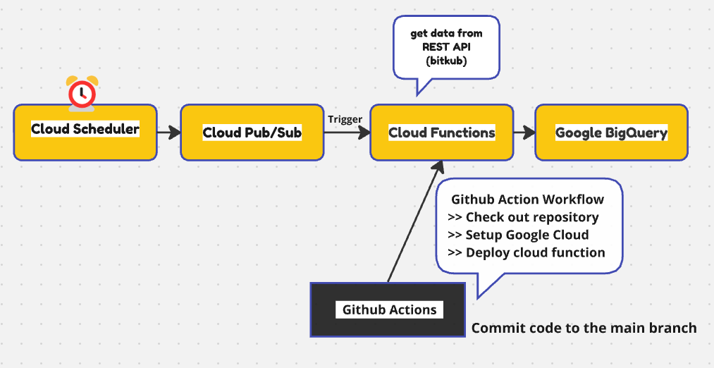
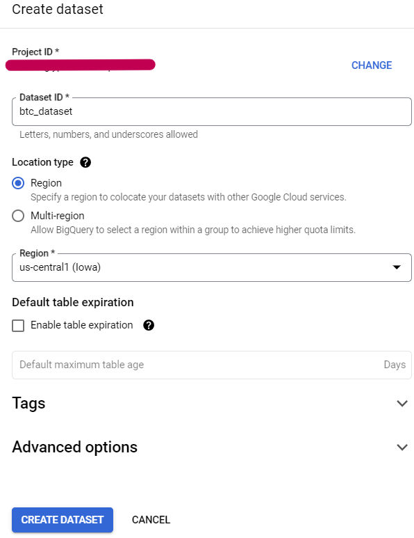
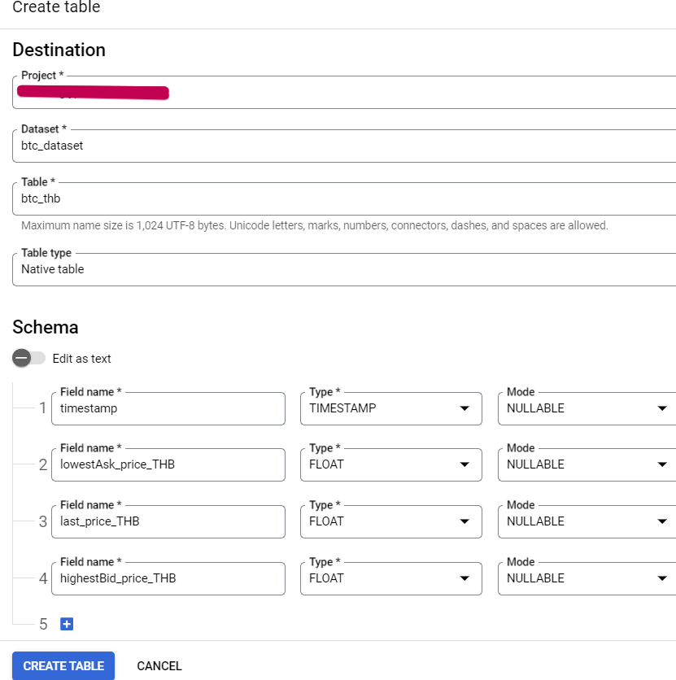
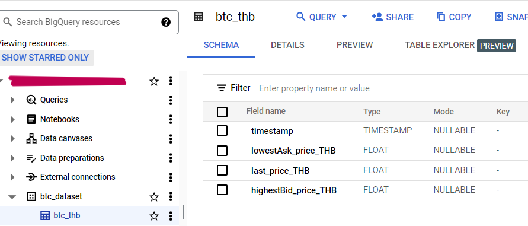
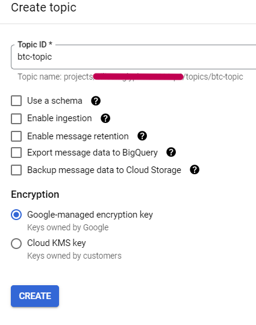
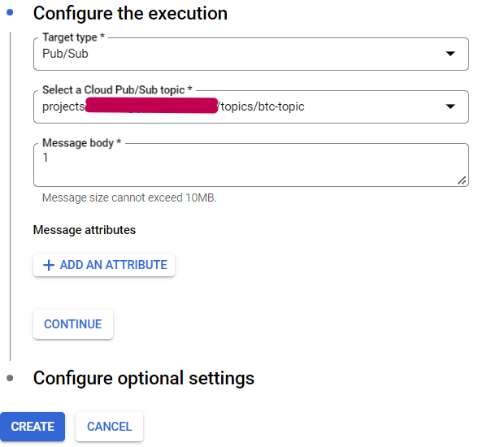

<h1> Auto-Deploy_Cloud_Functions </h1> 

    
  overview

<h2> 1) Create Cloud Scheduler job, Pub/Sub topic, dataset and table in BigQuery </h2>

   
    
    
  
 create the dataset and table successfully 
  
   
  
 set the schedule to have Cloud Pub/Sub execute every 5 minutes 

   
  
 create the Pub/Sub topic 
 
    

