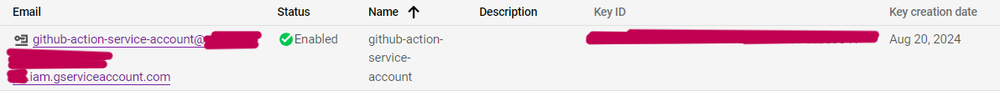
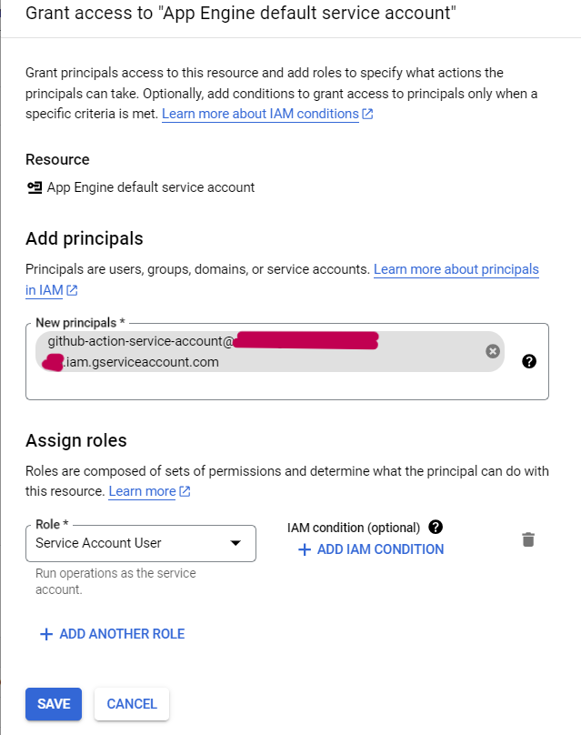

<h1> Auto-Deploy_Cloud_Functions </h1> 

    
  overview

<h2> 1) Create Cloud Scheduler job, Pub/Sub topic, dataset and table in BigQuery </h2>

   
    
    
  
 create the dataset and table successfully 
  
   
  
 set the schedule to have Cloud Pub/Sub execute every 5 minutes 

   
  
 create the Pub/Sub topic 
 
   
   
  
 create cloud scheduler job successfully 
  

<h2> 2) Create workflow in the GitHub repository </h2>

<h2> 3) Create a Service Account for connecting GitHub Actions with Google Cloud </h2>

   
  
 This service account has the role to deploy Cloud Functions 
  
   
  
 create a private key for the service account 

   
  
 Grant the App Engine default service account permission to use the github-action-service-account 

   
  
 Grant the Compute Engine default service account permission to use the github-action-service-account 

<h2> 4) Create secret in the repository </h2>

   
  
 GCP_PROJ_NAME -> Project ID  
      GCP_CREDENTIALS -> base64-encoded of the private key 

$`cat private_key_file_name.json|base64 -w 0`

<h2> 5) Push code to the main branch to run the workflow </h2>

<h2> Reference </h2>
https://github.com/google-github-actions/deploy-cloud-functions  
https://github.com/fonylew/simple-cloud-functions-to-bigquery

